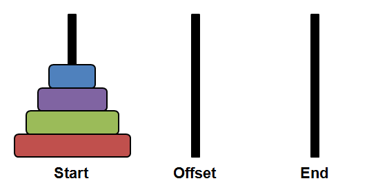

### Tower of Hanoi

The Tower of Hanoi is a puzzle.

It consists of three rods and a number of disks of different sizes, which can slide onto any rod. The puzzle starts with all the disks stacked on one rod, largest at the bottom, smallest at the top.

The objective of the puzzle is to move the entire stack to another rod, obeying the following simple rules:

1.  Only one disk can be moved at a time.
2.  Each move consists of taking the upper disk from one of the stacks and placing it on top of another stack.
3.  No disk may be placed on top of a smaller disk.

Here is an animation showing how a player would complete the puzzle with 4 disks.

If you'd like to learn more about the game, you can read the Wikipedia article on [Tower of Hanoi.](https://en.wikipedia.org/wiki/Tower_of_Hanoi)

### Pair Programming

You will work **in pairs** to create a javascript version of the Tower of Hanoi.

Your submission should be entirely the work of you and your partner - don't copy a solution written by someone else.

## Initial Configuration

The initial configuration of the game should be as follows:

- You should have three "towers", which can be represented by `
` elements. From left to right, these elements should have id attributes equal to `startTower`, `middleTower`, `endTower`.
- There should also be an element with id attribute equal to `status`, that you can use to display information to the user about the game's status.
- The game status element must display text "You Win!" once the player has successfully moved all the disks to the winning tower. `endTower` is considered the "winning tower", so the player must move all the disks to this tower in order to win.
- `startTower` should start out with all 4 disks on it
- The disks on `startTower` should be ordered from smallest at the top to largest at the bottom.

## Hints

- Make each tower a flex box that stacks elements from bottom to top using the following CSS properties:

  <pre>display: flex;  
  flex-direction: column-reverse;  
  align-items: center;</pre>

- You will want to have the player click twice for each move - first to pick the source tower, second to pick the destination tower. Use a variable to keep track of which mode the player is in.
- 
Add a click handler to each of the three towers. Use [event.currentTarget](https://developer.mozilla.org/en-US/docs/Web/API/Event/currentTarget) inside the event handler to determine which tower was clicked.

- Use the DOM property [childElementCount](https://developer.mozilla.org/en-US/docs/Web/API/ParentNode/childElementCount) to find how many disks are in a tower.
- Use the DOM property [lastElementChild](https://developer.mozilla.org/en-US/docs/Web/API/ParentNode/lastElementChild) to find the disk on top of a tower.
- Use the DOM method [appendChild()](https://developer.mozilla.org/en-US/docs/Web/API/Node/appendChild) to add a disk to a tower (you have already used this method many times in previous assignments). Note that when you use appendChild on an element that already has a parent, _it is automatically removed from the old parent and added to the new one._
